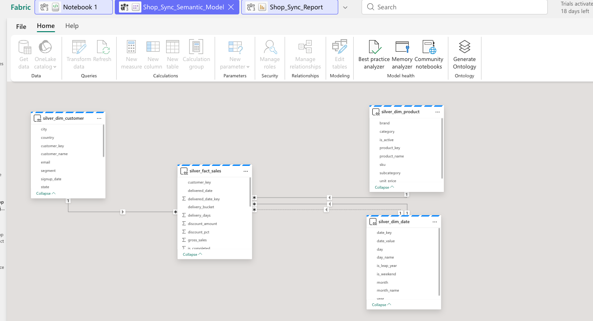

# ecommerce-data-pipeline-fabric
End-to-end e-commerce data pipeline using SQL, PySpark and Microsoft Fabric, including data cleaning, transformation, star schema modelling and Power BI dashboards for business insights.
## Project Dashboards & Data Model
### 1. Star Schema (Data Architecture)

### 2. Main Sales Dashboard

### 3. Delivery & Logistics Performance

### 4. Product & Customer Analytics

