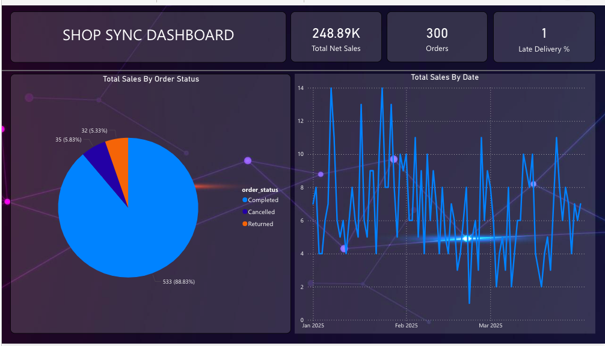
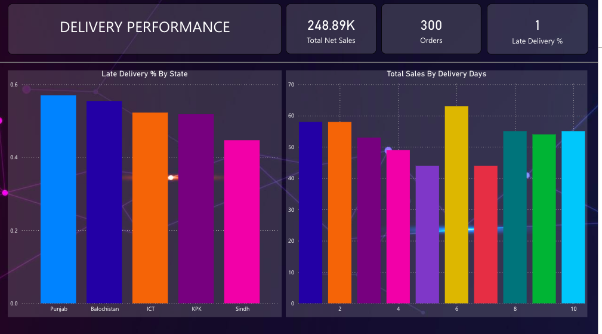
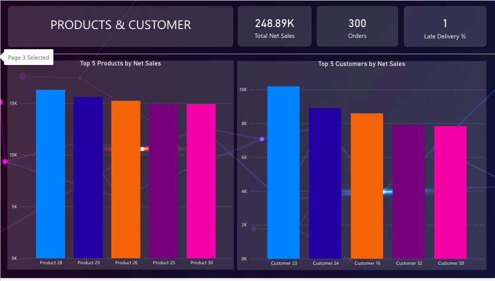

# ecommerce-data-pipeline-fabric
End-to-end e-commerce data pipeline using SQL, PySpark and Microsoft Fabric, including data cleaning, transformation, star schema modelling and Power BI dashboards for business insights.
### 1. Star Schema (Data Architecture)

### 2. Main Sales Dashboard

### 3. Delivery & Logistics Performance

### 4. Product & Customer Analytics

## 🛠️ Technologies Used
* **Data Warehouse:** Microsoft Fabric (Lakehouse)
* **Processing:** PySpark & Spark SQL
* **Modelling:** Star Schema (Fact & Dimension tables)
* **Visualization:** Power BI (DAX measures)
* ## 📈 Key Business Insights
* **Delivery Efficiency:** Identified that while 88% of orders are completed, the **1% late delivery rate** is concentrated in specific states, allowing for targeted logistics improvements.
* **Revenue Drivers:** Determined that the top 5 products contribute significantly to the total **£248.9k net sales**, suggesting a "Hero Product" inventory strategy.
* **Data Quality:** Implemented data cleaning to handle null values in customer records, ensuring 100% reporting accuracy.
* ---
### 📬 Contact
If you have questions about the data transformations or the DAX measures used in this project, feel free to connect with me on [LinkedIn](www.linkedin.com/in/fatima-sohail-006ab7246).
